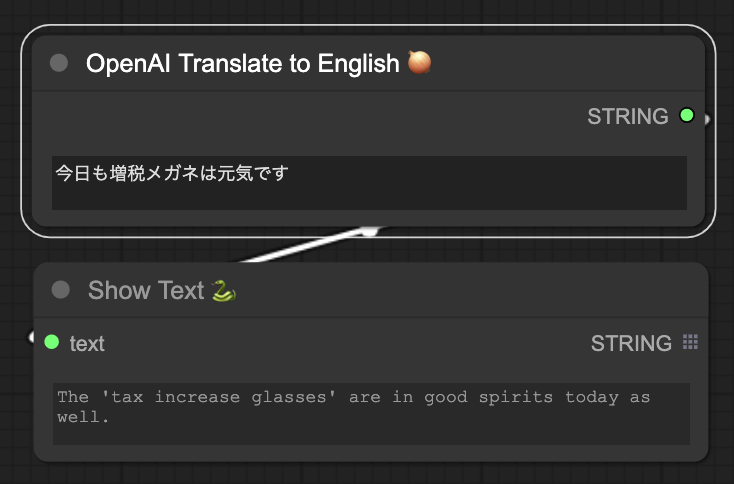
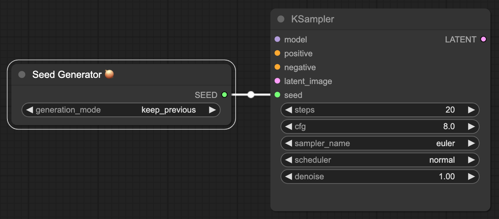

# ComfyUI-NegiTools

## Installation

- Install dependencies: pip install -r requirements.txt

- Clone the repository: git clone https://github.com/natto-maki/ComfyUI-NegiTools.git
  to your ComfyUI custom_nodes directory

  The script will then automatically install all custom scripts and nodes.
  It will attempt to use symlinks and junctions to prevent having to copy files and keep them up to date.

- To launch: Set the OPENAI_API_KEY environment variable before launching ComfyUI. 

  e.g., OPENAI_API_KEY=sk-<...your API key here...> python3 main.py ...

- For uninstallation:
  Delete the cloned repo in custom_nodes

## Update

1. Navigate to the cloned repo e.g. custom_nodes/ComfyUI-NegiTools
2. git pull

## Features

### Generator/OpenAI DALLe3

Generates an image using DALL-E3 via OpenAI API.

required: OPENAI_API_KEY.

- `prompt`: Specify a positive prompt; there is no negative prompt in DALL-E3. 
  The prompt can be written in any language.
- `resolution`: Select the output resolution from the candidates;
  the resolution combination is fixed in DALL-E3.
  The selected resolution will be output as WIDTH, HEIGHT.
- `dummy_seed`: DALL-E3 does not currently provide a way to specify a seed value. 
  This `dummy_seed` value is a parameter to control caching. 
  If the prompt and resolution are the same and dummy_seed has not changed, 
  this Node will reuse the cached output (i.e., the image will not change); 
  if `dummy_seed` has changed, it will generate a new image.
  Since it does not function as an actual seed value,
  the output will not be the same even if regenerated with the same value set.

REVISED_OUTPUT will output the prompts that DALL-E3 modified prior to generation.


### Generator/Noise Image Generator

Generate a noise image.

- `image_opt`: The target image to which the noise will be added. 
  If nothing is connected, it is assumed that the all 0 black image is used as input.
- `mask_opt`: Mask specifying the area where noise will be added. 
  If nothing is connected, the noise is added to all regions.
- `width`, `height`: Specifies the size of the image to be generated; 
  if an image is passed to `image_opt`, the size of the image is used and the value of this field is ignored.
- `method`:  Specifies the type of noise to be generated.
  \*_gray generates an image with the same RGB pixel values, 
  and \*_color generates independent RGB pixel values.
  Noise will be scaled to range of \[center - scale/2, center + scale/2\].
  - uniform: Generates noise uniformly distributed.
  - gaussian: Gaussian distribution with standard deviation = scale/2.
  - perlin: Perlin Noise
  - perlin_fractal: Perlin Noise with a gradually decaying high-frequency component.
- `seed`: Seed value for the random generator.
- `scale`, `bias`: Specifies a range of values. See the description of `method`.
- `perlin_freq_log2`: Specifies the base frequency of Perlin Noise. 
  Specifying a higher value produces more detailed noise.
- `perlin_octaves`: Used only for perlin_fractal. Specifies the number of high-frequency components.
- `perlin_persistence`: Used only for perlin_fractal. Specifies the amount of attenuation of high-frequency components.

Each component of the output image is scaled in the range of 0.0 to 1.0.


### Generator/Depth Estimation by Marigold (experimental)

Depth estimation using Marigold.


### utils/OpenAI Translate to English

Translates text written in any language into English using GPT-4.
This is useful when you want to write prompts in a language other than English
for input into Stable Diffusion.

It may be even more useful in combination with String Function.

required: OPENAI_API_KEY.




### utils/String Function

String generation using Python scripts.

Any Python script can be stored in `python_code`.
The script will be wrapped in a function and executed, and output a string that is returned by the `return` statement.

`a, b, c` are optional input strings. 
They can be accessed in the script as they are with the variable names `a, b, c`.

Available modules: random, re, numpy (as np)


`python_code` example:
```python
colors = ["red", "orange", "yellow", "green", "blue", "purple"]
return "a girl with %s hair and %s eyes wearing %s maid costume" % (
  random.choice(colors), random.choice(colors), a 
)
# got "a girl with green hair and red eyes wearing white maid costume", etc.
```


> [!NOTE]  
> The import statement and the eval() and exec() functions cannot be used in python_code field 
> for security reasons.

> [!CAUTION]
> This Node is capable of executing Python code and therefore has security risks. 
> Please review the python_code contents carefully before attempting to execute a workflow 
> received from a third party that cannot be fully trusted.


### utils/Seed Generator

Generate an integer to be used as the seed value.

Although Sampler, such as KSampler, allows the user to select a random or fixed value for the seed value, 
if they are set to random, the values are updated after workflow is executed.
This behavior making it difficult to restore the seed value 
after a good picture is obtained by random generation.

The "Seed Generator" node can be set to `random` or `keep_previous`,
and the seed value is generated at the time of workflow execution.
Therefore, you can set the Seed Generator node to `random` at first,
and repeat the generation process, 
then switch to `keep_previous` when a good picture is obtained, 
and fix the seed value thereafter.




### utils/ImageProperties

Outputs the properties of the image. Currently only the resolution (width and height) can be output.


### utils/LatentProperties

Outputs the properties of the latent image. Currently only the resolution (width and height) can be output.


### utils/CompositeImages

Composite two images with alpha.

- `image_B`: Background image.
- `image_F`: Foreground image.
- `mask_opt`: Optional MASK input.
  If connected, a value calculated by multiplying the mask and alpha is treated as the per-pixel alpha value.
- `method`: Specifies the composite algorithm.
- `alpha`: Specifies the alpha value. 
  If the alpha value is 0.0, `image_B` will be output directly; 
  if the alpha value is 1.0, the composite result will be output.
  For intermediate values, the output is the result of weighted average both images using alpha.


### utils/OpenPoseToPointList

Detects key points on the human body using OpenPose. Results are output as a JSON string.

This node is used in combination with utils/PointListToMask to generate masks based on key points.


### utils/PointListToMask

Generates a mask from the coordinate list output by utils/OpenPoseToPointList.

